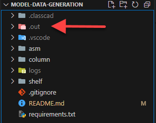

# Model Data Generation

## Content of this repo

```txt
├── asm
│   ├── asc.ccscript    - The ClassCAD code to build the rack assembly
│   ├── asm.csv         - Parameter input table for the rack assembly
│   └── asm.ps1         - Powershell script that iterates the parameter
│                         table and calls ClassCAD to create the rack assembly
├── column
│   ├── column.ccscript - The ClassCAD code to build the column part
│   ├── column.csv      - Parameter input table for the column part
│   └── column.ps1      - Powershell script that iterates the parameter
│                         table and calls ClassCAD to create the column part
├── shelf
│   ├── shelf.ccscript  - The ClassCAD code to build the shelf part
│   ├── shelf.csv       - Parameter input table for the shelf part
│   ├── shelf.ps1       - Powershell script that iterates the parameter
│   │                     table and calls ClassCAD to create the shelf part
│   └── shelf.py        - Just an example of the usage in python
```

## ClassCAD Installation/Execution

### Windows

To install and run ClassCAD, open a PowerShell or CMD window and:

```sh
git clone https://github.com/awv-informatik/model-data-generation
cd model-data-generation
mkdir -p .classcad
cd .classcad
cmd /c curl https://awvstatic.com/classcad/download/dev/17.1.3-dev.101/install-windows-x64.cmd -o "install.cmd"
cmd /c install.cmd
cmd /c del install.cmd

# Get a ClassCAD Key from https://beta0121.buerli.io/user/profile and save it to .classcad.appkey
notepad .classcad.appkey

# To start a ClassCAD http server
./classcad-cli.cmd hs
```

If everything worked you should see the following line in the console output.

```sh
HttpServer start listen on 0.0.0.0:9094
```

The ClassCAD process is now up and ready to receive requests.

### Ubuntu

To install and run ClassCAD, open a terminal and:

```sh
sudo apt-get update
sudo apt-get install -y libarchive-dev libgomp1 libglu1-mesa-dev ocl-icd-opencl-dev p7zip-full curl nano
# Ubuntu 20 only!
# sudo add-apt-repository -y ppa:ubuntu-toolchain-r/test
# sudo apt-get update
# sudo apt-get install -y libstdc++6

mkdir -p .classcad
cd .classcad
curl https://awvstatic.com/classcad/download/dev/17.1.3-dev.101/install-linux-x64.sh | bash # For ARM64, use 'install-linux-arm64.sh'

# Get a ClassCAD Key from https://beta0121.buerli.io/user/profile and save it to .classcad.appkey
nano .classcad.appkey

# To start a ClassCAD http server
./classcad-cli.sh hs
```

If everything worked you should see the following line in the console output.

```sh
HttpServer start listen on 0.0.0.0:9094
```

The ClassCAD process is now up and ready to receive requests.

## Data Generation

> Make sure ClassCAD is running!

> Usage on Ubuntu requires [Installing PowerShell on Ubuntu](https://learn.microsoft.com/en-us/powershell/scripting/install/install-ubuntu?view=powershell-7.4)

> You might get an error regarding ExecutionPolicy. In order to be able to run PowerShell scripts, you have to change that policy. Open a PowerShell Window and run the following command to do so.
>
> `Set-ExecutionPolicy -ExecutionPolicy RemoteSigned -Scope CurrentUser`
>
> More Information can be found at: https://go.microsoft.com/fwlink/?LinkID=135170

Open a PowerShell window, change the current working directory to the root of this repo and follow the instructions below.

If you run the scripts below, they are going to create several output files. All these files will be generated to the `.out` folder.



### Column

To run the script that builds colums, open a PowerShell window

```sh
cd column
./column.ps1
```

or right click on `column.ps1` and `Run with PowerShell` from menu (Windows only).

Then have a look at the directory `.out/column` to find the generated output files.

### Shelf

To run the script that builds shelfs, open a PowerShell window

```sh
cd shelf
./shelf.ps1
```

or right click on `shelf.ps1` and `Run with PowerShell` from menu (Windows only).

Then have a look at the directory `.out/shelf` to find the generated output files.

### Rack assembly

> Columns and shelfs has to be generated before. The rack assembly relies on those models.

To run the script that builds rack assemblies, open a PowerShell window

```sh
cd asm
./asm.ps1
```

or right click on `asm.ps1` and `Run with PowerShell` from menu (Windows only).

Then have a look at the directory `.out/asm` to find the generated output files.
